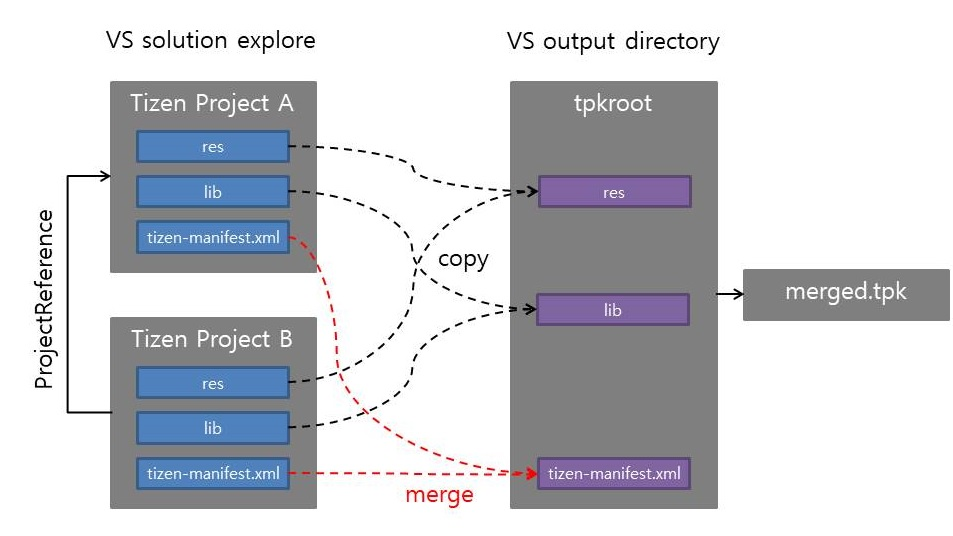

# Multi application in Tpk package

Since Tizen.NET.Sdk >= 1.0.1

## Overview of the multi application in tpk



### tpk structure of multi the application 
```
TPK
 |- bin
 |  |- Main.dll 
 |  |- Sub.dll
 |- res
 |  |- MainRES.png
 |  |- SubRES.png
 |- lib
 |- shared
 |  |- res 
 |  |  |- MainIcon.png
 |  |  |- SubIcon.png
 |- tizen-manifest.xml
```

### `tizen-manifest.xml` of the multi application 
```xml
<manifest xmlns='http://tizen.org/ns/packages' api-version='3' package='org.test.pkgid' version='1.0.0'>
    <profile name='common' />
    <ui-application appid='org.test.pkgid.mainappid' exec='Main.dll' type='dotnet' multiple='false' taskmanage='true' nodisplay='false' launch_mode='single'>
        <label>MainApp</label>
        <icon>MainIcon.png</icon>
    </ui-application>
    <ui-application appid='org.test.pkgid.subappid' exec='Sub.dll' type='dotnet' multiple='false' taskmanage='true' nodisplay='false' launch_mode='single'>
        <label>SubApp</label>
        <icon>SubIcon.png</icon>
    </ui-application>
    <privileges>
        <privilege>http://tizen.org/privilege/testmain</privilege>
        <privilege>http://tizen.org/privilege/testcommon</privilege>
        <privilege>http://tizen.org/privilege/testsub</privilege>
    </privileges>
    <feature name='http://tizen.org/feature/testmain'>true</feature>
    <feature name='http://tizen.org/feature/testcommon'>true</feature>
    <feature name='http://tizen.org/feature/testsub'>true</feature>
</manifest>
```


## How to create the multi application tpk

1. File > New > Project > Tizen .NET Project 
2. File > Add > New Project > Tizen .NET Project
3. Project > Add Refernece > Select Tizen .NET Project
4. Build Project

>  targetframework should be matached with main project
> `tizen40` or `netcoreapp2.0`

## Merge Manifest files in the multi application tpk
### Merge policies

| Elements | Match key |
|:--------:|------|
|`<ui-application>`| appid attribute |
|`<service-application>`| appid attribute |
|`<privilege>`| text value |
|`<feature>`| name attribute |


## See Also
- [Tizen.NET.Sdk Packaging](tizen.net.sdk-packaging-tpk.md)
